# Architecture overview

Onepercent is a **monorepo** containing two web applications, a shared database, and a set of reusable packages — all managed by **Turborepo**. Both apps connect to the same **Supabase** (PostgreSQL) backend, and the Admin app integrates with **WAHA** for WhatsApp messaging.

This page gives you a bird's-eye view of how everything fits together.

## System overview

Here's what the system looks like at a high level:

```mermaid
graph LR
    Members["🏋️ Gym Members"] --> Portal["Portal App"]
    Staff["🏢 Staff / Managers"] --> Admin["Admin App"]
    Portal --> Supabase["Supabase"]
    Admin --> Supabase
    Admin --> WAHA["WAHA"]
    Admin --> Resend["Resend"]
    Portal -.-> DB["@repo/database"]
    Admin -.-> DB
    Admin -.-> PDF["@repo/invoice-pdf"]
```



| Component | What it does |
| --- | --- |
| **Admin app** | Staff-facing CRM for managing members, bookings, payments, leads, commissions, and WhatsApp chats. |
| **Portal app** | Member-facing mobile app for booking sessions, checking in, viewing packages, and redeeming rewards. |
| **Supabase** | PostgreSQL database, authentication (JWT/PKCE), and real-time subscriptions. All data lives in a custom `gym` schema. |
| **WAHA** | Self-hosted WhatsApp HTTP API. Lets staff send and receive WhatsApp messages from inside the Admin app. |
| **Resend** | Email delivery service used to send invoices and portal invitations to members. |

## Monorepo structure

Turborepo manages the build pipeline and ensures shared packages are built before the apps that depend on them.

```
onepercent/
├── apps/
│   ├── admin/                # Staff CRM (port 3000)
│   └── portal/               # Member self-service (port 3002)
├── packages/
│   ├── database/             # @repo/database — shared Supabase types and enums
│   └── invoice-pdf/          # @repo/invoice-pdf — PDF invoice template
├── turbo.json                # Build pipeline configuration
└── package.json              # Root workspace configuration
```

### How packages connect

Both apps depend on `@repo/database` for TypeScript types. The Admin app also uses `@repo/invoice-pdf` to generate PDF invoices.


## The two apps

Both apps are built with **Next.js 15** using the **App Router**, **React 19**, and **TypeScript**. They share the same Supabase project but use separate authentication cookies to avoid session conflicts.

### Admin app

The Admin app is where gym staff spend their day. It has **13 permission-controlled modules**, organized into four groups:

| Group | Modules |
| --- | --- |
| **Core** | Dashboard, Analytics, Members, Leads |
| **Operations** | Package, Payment, Appointment, Point System |
| **Staff** | Trainer Schedule, Commission, Staff Profile |
| **Communication** | WhatsApp Chats, System Settings |

**Key architecture details:**

- **Route groups** — `(auth)` for login/password flows, `(staff)` for all protected routes.
- **Middleware** — Validates Supabase auth on every request. Staff profile and permission checks happen at the page/API level (not middleware) to avoid Edge Runtime limitations.
- **RBAC** — A two-tier permission system controls who can view, edit, and export data in each module. See [RBAC](./authentication/rbac) for details.
- **Real-time updates** — The members and appointments modules use Supabase Realtime channels to update the UI instantly when data changes.
- **WhatsApp** — A dedicated WebSocket connection to WAHA powers the live chat interface.

### Portal app

The Portal app is a mobile-first experience for gym members, built around four main tabs:

| Tab | What members can do |
| --- | --- |
| **Schedule** | View upcoming sessions, book new appointments, review past history. |
| **Attendance** | Check in to the gym, view attendance history. |
| **Packages** | See active packages (sessions remaining, expiry), view expired packages. |
| **Profile** | Edit personal info, view payments, check points balance, redeem rewards. |

**Key architecture details:**

- **Simpler auth** — No RBAC. The middleware checks for a valid Supabase session, and the app matches the user's email to the `member` table.
- **SWR everywhere** — All data fetching uses SWR hooks for caching, revalidation on focus, and optimistic updates.
- **No admin operations** — Members can't cancel appointments, modify packages, or access other members' data. These actions require staff.

## Database layer

Both apps connect to the same Supabase project. All tables live in a custom **`gym` schema** — not the default `public` schema. The Supabase client is configured to use `gym` automatically.

### Core tables

| Table | Purpose |
| --- | --- |
| `staff` | Staff profiles with role, branch, and status. |
| `member` | Member profiles and contact information. |
| `appointment` | Booked training sessions with status tracking. |
| `member_package` | Package purchases linked to members. |
| `member_payment` | Payment records with plan and type tracking. |
| `leads` | Prospect records from marketing channels. |
| `trainer_schedule` | Recurring weekly availability for each trainer. |
| `trainer_exclusion` | Blocked time slots (days off, holidays). |
| `role_permissions` | Default permissions per staff role. |
| `staff_permissions` | Per-staff permission overrides. |
| `merchandise` | Redeemable items in the loyalty programme. |
| `points_config` | Point earning and redemption rules. |

### Database views

Views (prefixed with `view_`) join related tables and compute derived fields. The apps query views instead of raw tables for most read operations — this keeps the frontend logic simple and the queries fast.

Examples:

- `view_2_member` — Members with computed status from their packages.
- `view_4_3_appointment` — Appointments with joined member and trainer names.
- `view_5_1_trainer_schedule` — Trainer availability with exclusions already applied.
- `view_5_2_trainer_monthly_commission_report` — Monthly commission totals per trainer.
- `view_1_4_monthly_revenue_trend` — Revenue trends for the analytics dashboard.

:::tip
Views handle the complex joins and calculations so the frontend doesn't have to. When you see a `view_` prefix in the codebase, you're looking at a pre-computed query.
:::

## Data flow

Here's how data typically moves through the system, using a member booking an appointment as an example:


### Supabase client types

Each app has **three Supabase client implementations**, each suited to a different context:

| Client | When to use | Auth scope |
| --- | --- | --- |
| **Browser client** | Client Components (React hooks, event handlers) | User's session cookie |
| **Server client** | Server Components, Server Actions, API routes | User's session from Next.js cookies |
| **Admin client** | Service-level operations (Admin app only) | Service role key — bypasses RLS |

:::warning
The admin client bypasses Row Level Security. Only use it for operations that genuinely require elevated access, like creating Supabase Auth users or sending password reset emails.
:::

## API layer (Admin)

The Admin app exposes API routes under `/api/` that follow a consistent pattern:

1. Create a server Supabase client.
2. Validate the user's authentication.
3. Look up the staff profile and check permissions.
4. Validate the request body (using **Zod** schemas).
5. Execute the business logic.
6. Return a JSON response.

### API route map

| Path | Purpose |
| --- | --- |
| `/api/auth/*` | Session management, staff CRUD, profile, avatar upload. |
| `/api/members/*` | Member listing, creation, phone/email validation, portal invites, Excel export. |
| `/api/appointments/*` | Booking, rescheduling, availability checks, bulk cancellation, compensation sessions. |
| `/api/leads/*` | Lead CRUD, status updates, remarks, Excel import/export. |
| `/api/operations/*` | Payment and package data exports. |
| `/api/invoices/*` | PDF generation, email delivery, remarks. |
| `/api/analytics/*` | Branch marketing cost tracking. |
| `/api/waha/*` | WhatsApp session management, messaging, chat retrieval. |
| `/api/webhooks/waha` | Incoming WhatsApp events (bypasses auth middleware). |

## Multi-branch architecture

The system supports multiple gym branches. Staff members are assigned to a branch, and their access is filtered accordingly:

- Staff with `branch = "all branch"` see data across all locations.
- Staff assigned to a specific branch (e.g., "kepong" or "kota damansara") only see data from their branch.

This filtering is enforced at both the API query level and the UI filter level.

## Tech stack

| Layer | Technology |
| --- | --- |
| Monorepo | Turborepo with npm workspaces |
| Framework | Next.js 15 (App Router) |
| Language | TypeScript (strict mode) |
| UI | React 19, Tailwind CSS v4, shadcn/ui |
| Database | Supabase (PostgreSQL), custom `gym` schema |
| Auth | Supabase Auth (JWT, PKCE) |
| Data fetching | SWR (client-side), Supabase Realtime (live updates) |
| Validation | Zod v4 |
| PDF generation | @react-pdf/renderer |
| Email | Resend |
| WhatsApp | WAHA (WhatsApp HTTP API) |
| Charts | Recharts |
| Excel | xlsx-js-style |

## What's next

- [Authentication overview](./authentication/overview) — How login, sessions, and cookie isolation work across both apps.
- [RBAC](./authentication/rbac) — The two-tier permission system that controls staff access.
