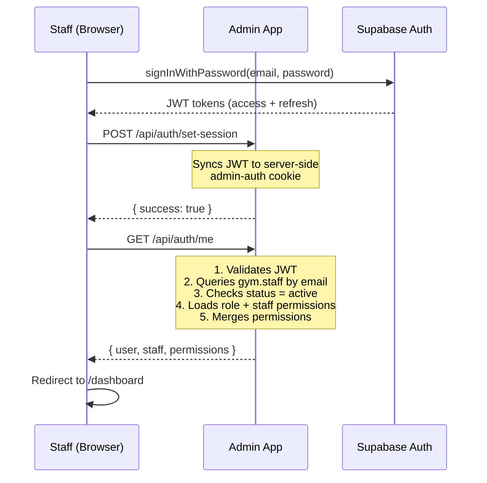
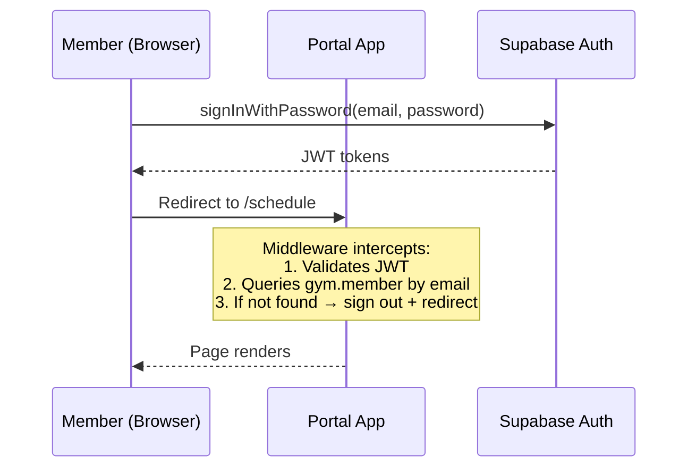

# Authentication

Onepercent uses **Supabase Auth** for both the Admin and Portal apps. Each app has its own login flow, its own cookie namespace, and its own way of verifying that the logged-in user is allowed in.

This page covers how authentication works end-to-end in both apps.

## Two-app auth model

The Admin and Portal apps run as separate Next.js applications. Even though they share the same Supabase project, they maintain **completely separate sessions** using different cookie names. This means a staff member logged into the Admin app won't accidentally share a session with the Portal app — and vice versa.

| | Admin app | Portal app |
| --- | --- | --- |
| **Who logs in** | Staff, trainers, managers | Gym members |
| **Login method** | Email and password | Email and password |
| **Cookie name** | `admin-auth` | `portal-auth` |
| **Identity table** | `gym.staff` | `gym.member` |
| **Identity check** | Page/API level (`requireStaffSession()`) | Middleware level (every request) |
| **Permission system** | RBAC with 13 modules | None — all members have the same access |
| **Account creation** | Admin creates staff accounts | Admin creates member accounts |
| **First-time setup** | Staff receives an invite email | Members use "Forgot password" to set their password |

:::note
Neither app supports self-registration. All accounts are created by gym staff through the Admin app.
:::

## How login works

### Admin login flow

When a staff member logs in, the app goes through a multi-step process to verify their identity, sync the session to the server, and load their permissions.



**Step by step:**

1. The login form validates input with Zod, then calls `supabase.auth.signInWithPassword()`.
2. On success, the browser has a JWT but the server doesn't know about it yet. The app posts the session to `/api/auth/set-session` to sync it to a server-side `admin-auth` cookie.
3. The app calls `/api/auth/me` to verify the staff profile. This endpoint:
   - Validates the JWT via `supabase.auth.getUser()`.
   - Queries `gym.staff` by email (case-insensitive with `.ilike()`).
   - Checks that `status` is `"active"`.
   - Loads permissions from `role_permissions` and `staff_permissions`, then merges them.
4. If everything checks out, the user is redirected to the dashboard. If the staff profile is missing or inactive, the user is signed out and sent back to `/login?message=no-access`.

:::tip
The `/api/auth/me` endpoint also retries — the login form polls it up to 6 times with increasing delays to handle the brief window where the server cookie hasn't fully propagated yet.
:::

### Portal login flow

The Portal login is simpler — no RBAC, no permission loading. But the member identity check happens in middleware, not at the page level.



**Step by step:**

1. The login form calls `supabase.auth.signInWithPassword()`.
2. On success, the app redirects to the root `/` which immediately sends the member to `/schedule`.
3. The middleware intercepts the request, validates the Supabase session, and queries the `member` table using the admin client (service role) to confirm the email exists.
4. If no matching member is found, the middleware signs the user out and redirects to `/login?error=unauthorized`.

### First-time member setup

Members don't self-register. Here's how a new member gets access to the Portal:

1. A staff member creates the member account in the Admin app and sends a portal invitation email.
2. The member clicks the invite link, which lands on `/auth/callback`.
3. The callback page detects the invite type and redirects to `/reset-password?type=invite`.
4. The member sets their password (minimum 8 characters).
5. The app signs them out and redirects to `/login?message=account_ready`.
6. The member logs in with their new password.

## Session management

### Why session sync exists

Supabase Auth manages JWTs on the client side (in memory or localStorage). But Next.js server components and API routes need access to the session too — for server-side rendering and protected API calls.

The **session sync** pattern bridges this gap: after any auth state change, the browser posts the JWT to `/api/auth/set-session`, which writes it to an HTTP-only cookie that the server can read.

### When session sync happens

Both apps listen for Supabase auth state changes and sync automatically:

| Event | What happens |
| --- | --- |
| `SIGNED_IN` | JWT is posted to `/api/auth/set-session` and saved as a cookie. |
| `TOKEN_REFRESHED` | Updated JWT replaces the existing cookie. |
| `SIGNED_OUT` | Cookie is cleared via `supabase.auth.signOut()` on the server. |
| `INITIAL_SESSION` | Skipped — fires on every page load and doesn't need re-syncing. |

In the Admin app, this listener is a singleton registered by the `useCurrentStaff()` hook, ensuring it only runs once per browser session.

### Session polling (Admin only)

The `useCurrentStaff()` hook polls `/api/auth/me` every **60 seconds** via SWR. This keeps the staff profile and permissions in sync even if they're changed by another admin while the user is logged in.

```ts
useSWR("/api/auth/me", fetcher, {
  revalidateOnFocus: true,
  revalidateOnReconnect: true,
  refreshInterval: 60_000,
});
```

If the endpoint returns **403** (staff deactivated or deleted), the hook automatically signs the user out.

## Middleware

Both apps use middleware to protect routes, but they handle it differently.

### Admin middleware

The Admin middleware only checks whether a Supabase session exists. It does **not** query the database — staff profile and permission checks are deferred to individual pages and API routes.

**Protected by middleware:**
- All routes under `(staff)/`

**Bypassed:**
- `/_next/*` (static assets)
- `/api/webhooks/*` (incoming webhooks)
- Static files (anything with a file extension)
- `/login`, `/forgot-password`, `/reset-password`, `/auth/*`

**Why no database check in middleware?** The Admin middleware runs in Next.js Edge Runtime, which has limited support for database connections. Staff validation is handled by `requireStaffSession()` in server components and by direct queries in API routes instead.

### Portal middleware

The Portal middleware goes further — it checks the Supabase session **and** queries the `member` table to verify the user exists. This is possible because it uses the admin client (service role), which doesn't rely on user-scoped cookies.

**Protected by middleware:**
- All routes under `(protected)/`

**Bypassed:**
- All `/api/*` routes (excluded from matcher entirely)
- `/login`, `/forgot-password`, `/reset-password`, `/auth/callback`

**If no member record is found:** The middleware calls `supabase.auth.signOut()` and redirects to `/login?error=unauthorized`.

## Supabase clients

Each app creates three distinct Supabase client instances, each suited to a different runtime context.

### Browser client

Used in client components (hooks, event handlers, forms).

| | Admin | Portal |
| --- | --- | --- |
| **Export style** | `getSupabaseBrowserClient()` (lazy singleton function) | `supabaseBrowser` (module-level singleton) |
| **Cookie name** | `admin-auth` | `portal-auth` |
| **Reset function** | `resetSupabaseBrowserClient()` (used on sign-out) | None |

### Server client

Used in server components, server actions, and API routes. Must be `await`ed because it reads Next.js cookies asynchronously.

```ts
const supabase = await createSupabaseServerClient();
```

Both apps implement this identically, differing only in cookie name.

### Admin client (service role)

Used for operations that bypass Row Level Security — creating auth users, deleting accounts, sending invites, and (in the Portal) checking member existence in middleware.

```ts
const supabase = createSupabaseAdminClient();
```

:::danger
The admin client uses the `SUPABASE_SERVICE_ROLE_KEY` and bypasses all RLS policies. Only use it for operations that genuinely require elevated access. Never expose the service role key to the browser.
:::

## Auth API endpoints (Admin)

| Endpoint | Method | Purpose |
| --- | --- | --- |
| `/api/auth/set-session` | POST | Sync browser JWT to server-side cookie. |
| `/api/auth/me` | GET | Return current user, staff profile, and merged permissions. |
| `/api/auth/profile` | PATCH, POST | Update own profile or upload own avatar. |
| `/api/auth/staff` | GET, POST | List all staff with permissions; create new staff (admin only). |
| `/api/auth/staff/[staffId]` | PATCH | Update a staff member's role, status, branch, or permissions. |
| `/api/auth/staff/[staffId]/avatar` | POST | Upload avatar for a specific staff member. |
| `/api/auth/staff/[staffId]/reset-password` | PATCH | Reset a staff member's password via Supabase admin API. |

## Auth API endpoints (Portal)

| Endpoint | Method | Purpose |
| --- | --- | --- |
| `/api/auth/check-email` | GET | Check if an email exists in the `member` table (used by forgot-password). |

## Key files reference

### Admin app

| File | Purpose |
| --- | --- |
| `proxy.ts` | Middleware — validates Supabase session on protected routes. |
| `src/lib/supabase-browser.ts` | Browser client singleton with `admin-auth` cookie. |
| `src/lib/supabase-server.ts` | Server client factory using Next.js cookies. |
| `src/lib/supabase-admin.ts` | Service role client for admin operations. |
| `src/lib/auth.ts` | `requireStaffSession()` and `getOptionalStaffSession()` helpers. |
| `src/lib/rbac.ts` | Permission merging and checking utilities. |
| `src/hooks/use-current-staff.ts` | SWR hook for staff profile, permissions, and auth state listener. |
| `src/components/auth/login-form.tsx` | Login form with session sync and retry logic. |

### Portal app

| File | Purpose |
| --- | --- |
| `src/proxy.ts` | Middleware — validates session and checks member existence. |
| `src/lib/supabase-browser.ts` | Browser client singleton with `portal-auth` cookie. |
| `src/lib/supabase-server.ts` | Server client factory using Next.js cookies. |
| `src/lib/supabase-admin.ts` | Service role client for member lookup in middleware. |
| `src/app/login/page.tsx` | Login page with error/message handling. |
| `src/app/(auth)/auth/callback/page.tsx` | Handles PKCE code exchange and invite link tokens. |
| `src/hooks/use-member-profile.ts` | SWR hook for member profile and stats. |

## What's next

- [Role-based access control](./rbac) — How the Admin app's two-tier permission system controls staff access to modules.
