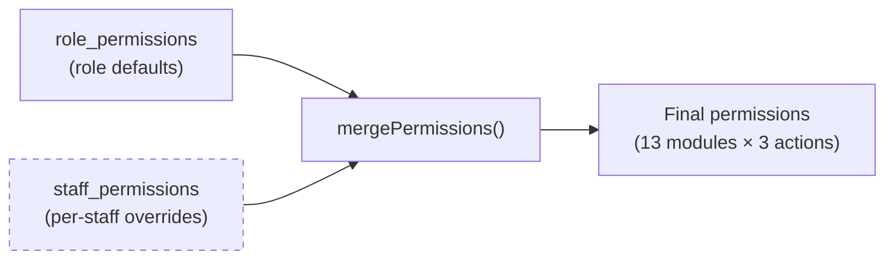

# Role-based access control

The Admin app uses a **two-tier permission system** to control what each staff member can access. Every module in the sidebar is gated by permissions, and gym owners can customize access down to the individual staff level.

## How it works

Permissions come from two database tables:

1. **`role_permissions`** — Default permissions for each staff role (e.g., all trainers get the same baseline).
2. **`staff_permissions`** — Per-staff overrides that take priority over role defaults.

When the system loads a staff member's permissions, it starts with their role defaults, then applies any staff-specific overrides on top. This means you can give a specific trainer access to the analytics module without changing permissions for all trainers.



## Modules

The system defines **13 permission modules**, each mapped to a section of the Admin app:

| Module key | Sidebar section |
| --- | --- |
| `dashboard` | Dashboard |
| `analytics` | Analytics and reports |
| `members` | Member management |
| `leads` | Lead tracking |
| `operations-package` | Package management |
| `operations-payment` | Payment processing |
| `operations-point-system` | Loyalty points |
| `operations-appointment` | Appointment scheduling |
| `staff-trainer-schedule` | Trainer schedules |
| `staff-commission` | Commission tracking |
| `staff-profile` | Staff profiles |
| `chats` | WhatsApp messaging |
| `system-settings` | System configuration (admin only) |

## Actions

Each module supports three permission actions:

| Action | What it controls |
| --- | --- |
| `can_view` | Whether the staff member can see the module and its data. If `false`, the sidebar link is hidden and the page shows an access denied message. |
| `can_edit` | Whether the staff member can create, update, or delete records in the module. |
| `can_export` | Whether the staff member can export data to Excel or CSV. |

:::note
`can_edit` and `can_export` are only meaningful if `can_view` is `true`. A staff member can't edit data in a module they can't see.
:::

## Permission resolution

The `mergePermissions()` function combines role defaults and staff overrides into a final permission set:

```ts
export function mergePermissions(
  roleDefaults: PermissionRow[],
  staffOverrides: PermissionRow[]
): GranularPermissions[] {
  const map = new Map<string, GranularPermissions>();

  // Step 1: Apply role defaults
  for (const entry of roleDefaults) {
    map.set(entry.module, { ...entry, source: "role" });
  }

  // Step 2: Staff overrides replace role defaults
  for (const entry of staffOverrides) {
    map.set(entry.module, { ...entry, source: "override" });
  }

  // Step 3: Ensure all 13 modules are present, defaulting to false
  return MODULE_KEYS.map(
    (module) =>
      map.get(module) ?? {
        module,
        can_view: false,
        can_edit: false,
        can_export: false,
        source: "role",
      }
  );
}
```

**Key behaviors:**

- If a module has no role default and no staff override, all three actions default to `false`.
- The `source` field tracks where each permission came from — `"role"` for defaults, `"override"` for staff-specific changes.
- The role is derived from the staff member's `category` field (lowercased), defaulting to `"trainer"` if empty.

## Checking permissions in code

Two helper functions make it easy to check permissions anywhere in the Admin app:

### `hasPermission()`

Checks whether a staff member has a specific action on a specific module.

```ts
import { hasPermission } from "@/lib/rbac";

if (hasPermission(permissions, "members", "edit")) {
  // Show edit button
}

if (hasPermission(permissions, "operations-payment", "export")) {
  // Show export button
}
```

### `canAccessModule()`

Shorthand for checking `can_view` — used to decide whether to show a sidebar link or render a page.

```ts
import { canAccessModule } from "@/lib/rbac";

if (canAccessModule(permissions, "analytics")) {
  // Show analytics link in sidebar
}
```

### `useCurrentStaff()` hook

On the client side, the `useCurrentStaff()` hook provides these checks as methods:

```ts
const { hasPermission, canAccessModule } = useCurrentStaff();

// Check directly from the hook
if (hasPermission("leads", "edit")) {
  // Allow editing leads
}
```

### `ModuleAccessBoundary` component

For page-level gating, wrap content in the `ModuleAccessBoundary` component:

```tsx
<ModuleAccessBoundary module="analytics" action="view">
  <AnalyticsDashboard />
</ModuleAccessBoundary>
```

If the user doesn't have the required permission, the boundary renders an access denied message instead of the content.

## Where permissions are enforced

Permissions are checked at **three levels** in the Admin app:

| Level | How | Purpose |
| --- | --- | --- |
| **Sidebar** | `canAccessModule()` hides links for inaccessible modules. | Prevents users from seeing navigation items they can't use. |
| **Page** | `ModuleAccessBoundary` wraps page content. | Shows an access denied message if a user navigates directly to a URL. |
| **API** | API routes query `staff_permissions` and check before executing. | Prevents unauthorized data access even if the UI is bypassed. |

:::warning
Always enforce permissions at the API level, not just the UI. Hiding a sidebar link or page doesn't prevent someone from calling the API directly.
:::

## Database tables

### `role_permissions`

Stores default permissions per staff role.

| Column | Type | Description |
| --- | --- | --- |
| `role` | `text` | Staff category (e.g., `"trainer"`, `"admin"`, `"super_admin"`). |
| `module` | `text` | Module key (e.g., `"members"`, `"analytics"`). |
| `can_view` | `boolean` | Default view access for this role. |
| `can_edit` | `boolean` | Default edit access for this role. |
| `can_export` | `boolean` | Default export access for this role. |

### `staff_permissions`

Stores per-staff permission overrides.

| Column | Type | Description |
| --- | --- | --- |
| `staff_id` | `uuid` | References `gym.staff.id`. |
| `module` | `text` | Module key. |
| `can_view` | `boolean` | Override view access for this staff member. |
| `can_edit` | `boolean` | Override edit access for this staff member. |
| `can_export` | `boolean` | Override export access for this staff member. |

## Types

```ts
// All 13 module keys
type ModuleKey =
  | "dashboard" | "analytics" | "members" | "leads"
  | "operations-package" | "operations-payment"
  | "operations-point-system" | "operations-appointment"
  | "staff-trainer-schedule" | "staff-commission"
  | "staff-profile" | "chats" | "system-settings";

// Three possible actions per module
type PermissionAction = "view" | "edit" | "export";

// The resolved permission for a single module
interface GranularPermissions {
  module: ModuleKey | string;
  can_view: boolean;
  can_edit: boolean;
  can_export: boolean;
  source: "role" | "override";
}
```

## Example scenario

Say you have a trainer named Alex who should be able to view analytics but not export data from it:

1. The `"trainer"` role in `role_permissions` has `analytics.can_view = false` by default.
2. An admin adds a `staff_permissions` entry for Alex: `analytics.can_view = true`, `analytics.can_export = false`.
3. When Alex logs in, `mergePermissions()` starts with the trainer defaults, then applies Alex's override.
4. Result: Alex can see the analytics page but won't see the export button.

## Key files

| File | Purpose |
| --- | --- |
| `src/lib/rbac.ts` | `MODULE_KEYS`, `mergePermissions()`, `hasPermission()`, `canAccessModule()`. |
| `src/hooks/use-current-staff.ts` | Loads permissions via SWR and exposes `hasPermission()` and `canAccessModule()` on the client. |
| `src/components/layout/app-sidebar.tsx` | Uses `canAccessModule()` to show or hide sidebar links. |
| `src/components/layout/module-access-boundary.tsx` | Wraps page content with a permission check. |
