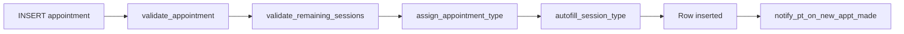

# Functions, triggers, and cron jobs

The `gym` schema uses PostgreSQL functions and triggers to enforce business rules, automate calculations, and send notifications directly at the database level. This ensures consistency regardless of which app (admin or portal) makes the change.

## Triggers by table

### appointment (7 triggers)

The appointment table has the most triggers, enforcing validation and automating status transitions.

| Trigger | Timing | Event | Function | Purpose |
| --- | --- | --- | --- | --- |
| `validate_appointment_trigger` | BEFORE | INSERT, UPDATE | `validate_appointment()` | Validates appointment constraints (time conflicts, schedule availability, date ranges). |
| `validate_remaining_sessions_trigger` | BEFORE | INSERT, UPDATE | `validate_remaining_sessions()` | Checks the member's package has enough remaining sessions before booking. |
| `member_book_appointment` | BEFORE | INSERT | `assign_appointment_type()` | Auto-assigns the `category` field (leads or member) based on the booking context. |
| `autofill_session_type_trigger` | BEFORE | INSERT, UPDATE | `autofill_session_type()` | Auto-fills the `session_type` field (paid, bonus, compensation) based on session availability. |
| `new_appt_made_by_member` | AFTER | INSERT | `notify_pt_on_new_appt_made()` | Sends a notification to the trainer when a member books a new session from the portal. |
| `appt_confirmed` | AFTER | UPDATE | `notify_member_on_appt_confirmed()` | Notifies the member when their appointment status changes to confirmed. |
| `complete_session` | BEFORE | UPDATE | `update_appt_status_claim_point()` | When a session is marked as completed, automatically claims points for the member based on earning rules. |

---

### member (1 trigger)

| Trigger | Timing | Event | Function | Purpose |
| --- | --- | --- | --- | --- |
| `new_member_trigger` | BEFORE | INSERT | `update_leads_status()` | When a new member is registered, automatically marks the linked lead as "converted" and sets the `converted_at` timestamp. |

---

### leads (1 trigger)

| Trigger | Timing | Event | Function | Purpose |
| --- | --- | --- | --- | --- |
| `bot_update_collected_info` | AFTER | UPDATE | `update_bot_remark()` | When a lead's bot-collected fields (fitness_goal, weight, height, workout_experience) are updated, automatically creates a bot remark summarizing the collected information. |

---

### member_payment (2 triggers)

| Trigger | Timing | Event | Function | Purpose |
| --- | --- | --- | --- | --- |
| `member_made_payment` | AFTER | INSERT | `generate_member_invoice()` | Automatically generates an invoice record with a sequential invoice number when a payment is recorded. |
| `package_purchase_renew` | AFTER | INSERT | `claim_package_purchase_renewal_points()` | Awards loyalty points to the member based on the payment amount and active earning rules. |

---

### member_points_transaction (2 triggers)

| Trigger | Timing | Event | Function | Purpose |
| --- | --- | --- | --- | --- |
| `trigger_generate_redemption_code` | BEFORE | INSERT | `generate_redemption_code()` | Auto-generates a unique redemption code for redeem transactions (used for QR-based fulfilment). |
| `redeem_detection` | AFTER | INSERT | `insert_redeemption_fulfilment()` | When a redeem transaction is inserted, automatically creates a fulfilment record with "pending" status. |

---

### trainer_schedule (1 trigger)

| Trigger | Timing | Event | Function | Purpose |
| --- | --- | --- | --- | --- |
| `trainer_availability_ai` | BEFORE | INSERT | `trainer_availability_close_whole_day()` | Automatically adjusts trainer availability when a new schedule is added (used for AI booking logic). |

---

### whatsapp_outbox (1 trigger)

| Trigger | Timing | Event | Function | Purpose |
| --- | --- | --- | --- | --- |
| `whatsapp_outbox_webhook_trigger` | AFTER | INSERT | `notify_n8n_webhook()` | When a message is queued in the outbox, triggers an n8n webhook to process and send the message via WhatsApp. |

---

### whatsapp_settings (1 trigger)

| Trigger | Timing | Event | Function | Purpose |
| --- | --- | --- | --- | --- |
| `whatsapp_settings_updated_at` | BEFORE | UPDATE | `update_whatsapp_settings_updated_at()` | Automatically updates the `updated_at` timestamp when WhatsApp settings are modified. |

---

## Standalone functions

These functions are called directly via `.rpc()` from the application or by the cron scheduler, not by triggers.

### calculate_all_commission()

Recalculates commission for all trainers across all branches. Called daily by the cron job.

- **Called by:** pg_cron (midnight daily)
- **Logic:** Iterates over all active trainers, calculates conduction fees and sales commission for the current month using tiered rates from `trainer_commission_tier`, and upserts results into `trainer_monthly_commission`.

### calculate_trainer_commission(trainer_id, year, month)

Calculates commission for a single trainer for a specific month.

- **Called by:** `calculate_all_commission()` internally
- **Logic:** Counts completed sessions by type (paid, free, transform, express, sponsor, compensate), looks up the applicable tier rate based on session count and sales thresholds, calculates conduction fees per session type, and calculates sales commission for new and renewal sales.

### handle_appointment_compensation(appointment_id)

Creates a compensation session for a cancelled appointment.

- **Called by:** Admin app via `.rpc()`
- **Logic:** Looks up the original appointment, increments the `compensation_session` count on the member's package, and flags the original appointment as `is_compensated = true`.

### update_appointment_skip_validation(appointment_id, updates)

Updates an appointment bypassing the normal validation triggers.

- **Called by:** Admin app via `.rpc()` for administrative overrides
- **Logic:** Directly updates the appointment row without firing `validate_appointment` or `validate_remaining_sessions` triggers.

### get_next_invoice_number()

Returns the next sequential invoice number.

- **Called by:** `generate_member_invoice()` trigger function
- **Logic:** Queries the highest existing invoice number and increments by 1.

### remove_tag_from_all_conversations(tag_name)

Removes a specific tag from all WhatsApp conversations.

- **Called by:** Admin app via `.rpc()` when a tag is deleted
- **Logic:** Updates the `tags` array on all `whatsapp_conversations` rows, removing the specified tag.

---

## Cron jobs

The system uses `pg_cron` (Supabase's built-in job scheduler) for scheduled background tasks.

| Schedule | Command | Purpose |
| --- | --- | --- |
| `0 0 * * *` (midnight daily) | `SELECT gym.calculate_all_commission()` | Recalculates all trainer commissions for the current month. Runs at midnight UTC daily to keep commission reports up to date. |

:::note
Commission is recalculated daily rather than in real-time because the calculation involves multiple table joins and tiered lookups. Running it once daily keeps the system performant while ensuring reports are always fresh by morning.
:::

## Trigger execution order

PostgreSQL fires triggers in alphabetical order within the same timing and event. For the `appointment` table with multiple BEFORE INSERT triggers, the execution order is:

1. `autofill_session_type_trigger`
2. `member_book_appointment`
3. `validate_appointment_trigger`
4. `validate_remaining_sessions_trigger`

:::warning
Changing trigger names can alter execution order and break business logic. If you need to add a new trigger, consider how its name affects the alphabetical ordering.
:::
