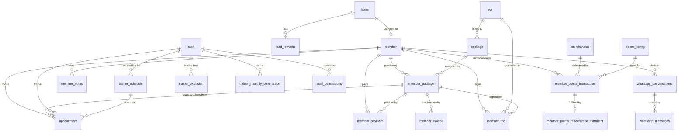

# Schema overview

The entire database lives in a custom **`gym` schema** inside Supabase (PostgreSQL). The default `public` schema is not used for application data. Both the admin and portal Supabase clients are configured to target the `gym` schema by default.

## Why a custom schema?

Using a dedicated schema keeps application tables separate from Supabase internals (`auth`, `storage`, `realtime`, `extensions`). This makes it easier to manage migrations, generate types, and reason about permissions without accidentally modifying system tables.

## Naming conventions

| Convention | Example | Notes |
| --- | --- | --- |
| **Tables** | `member`, `trainer_schedule` | Singular nouns, snake_case. |
| **Views** | `view_2_member`, `view_4_3_appointment` | Prefixed with `view_` and a numbering system (see below). |
| **Enums** | `appointment_status`, `payment_type` | snake_case, descriptive. |
| **Functions** | `calculate_all_commission()` | snake_case, verb-first. |
| **Triggers** | `new_member_trigger`, `complete_session` | Descriptive of the event. |
| **Columns** | `member_id`, `start_time`, `is_active` | snake_case, prefixed booleans with `is_`. |

### View numbering system

Views follow a numbered prefix that maps to sidebar modules in the admin app:

| Prefix | Module |
| --- | --- |
| `view_1_*` | Analytics / dashboard |
| `view_2_*` | Members |
| `view_3_*` | Leads |
| `view_4_*` | Operations (packages, payments, appointments) |
| `view_5_*` | Staff (trainer schedule, commission) |
| `view_6_*` | Point system |

## Table groups

The 32 tables in the `gym` schema fall into these logical groups:

### Core entities

| Table | Rows | Purpose |
| --- | --- | --- |
| `member` | 183 | Gym members / customers. |
| `staff` | — | Staff members (trainers, admins, super admins). |
| `leads` | — | Prospect tracking before conversion to member. |
| `lead_remarks` | — | Conversation log entries per lead. |
| `member_notes` | — | Internal notes on a member. |

### Packages and payments

| Table | Purpose |
| --- | --- |
| `package` | Package catalog (templates with pricing, session counts, features). |
| `member_package` | Purchased package linking a member to a package with dates and sessions. |
| `member_payment` | Payment records (amount, type, plan, proof). |
| `member_invoice` | Auto-generated invoices per payment. |
| `tnc` | Terms and conditions documents (versioned, per branch). |
| `member_tnc` | Signed T&C records with member and staff signatures. |

### Appointments

| Table | Purpose |
| --- | --- |
| `appointment` | Training session bookings with status lifecycle. |
| `trainer_schedule` | Recurring weekly availability slots. |
| `trainer_exclusion` | Blocked time (holidays, leave, personal time). |

### Commission

| Table | Purpose |
| --- | --- |
| `trainer_commission_tier` | Tiered rate configuration by category, session type, and thresholds. |
| `trainer_monthly_commission` | Pre-calculated monthly commission per trainer per member. |
| `branch_marketing_cost` | Marketing spend per branch per month (for analytics). |

### Points and merchandise

| Table | Purpose |
| --- | --- |
| `points_config` | Earning rules (points per RM spent). |
| `member_points_transaction` | Earn and redeem transaction log. |
| `member_points_redeemption_fulfilment` | Redemption fulfilment tracking with QR codes. |
| `merchandise` | Merchandise catalog available for point redemption. |

### Permissions

| Table | Purpose |
| --- | --- |
| `role_permissions` | Default permissions per role (admin, trainer, super_admin). |
| `staff_permissions` | Per-staff permission overrides that take precedence over role defaults. |

### WhatsApp / messaging

| Table | Purpose |
| --- | --- |
| `whatsapp_conversations` | Conversation threads with members. |
| `whatsapp_messages` | Individual messages with AI processing metadata. |
| `whatsapp_outbox` | Outbound message queue (triggers n8n webhook). |
| `whatsapp_sessions` | WAHA session state (connection status, QR codes). |
| `whatsapp_settings` | Tags, templates, and configuration. |
| `whatsapp_templates` | Reusable message templates. |
| `message_reply_template` | Quick reply templates. |
| `message_source_template` | Auto-routing templates by source channel. |

### Knowledge base

| Table | Purpose |
| --- | --- |
| `chat_history` | Chat interaction history. |
| `knowledge` | Knowledge base articles for AI responses. |

## Entity-relationship diagram

The diagram below shows the primary relationships between core tables. Foreign keys are represented as arrows.

:::note
This diagram shows logical relationships. Some foreign keys are enforced at the database level, while others are enforced by application logic (e.g., `member_id` on `appointment` references `member.id` but may not have a formal FK constraint).
:::

## Type generation

Database types are auto-generated from the live schema and shared across both apps:

1. Run `npm run types:generate` from the project root.
2. Types are written to `packages/database/src/database.types.ts`.
3. Helper types and enum arrays are exported from `packages/database/src/database.helpers.ts`.
4. Both apps import via `@repo/database`.

See the [enums reference](./enums) for all enum types and their allowed values.
