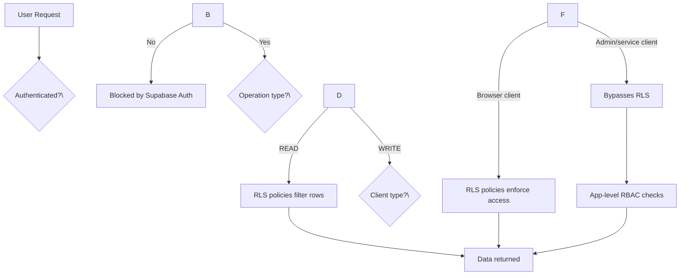

# Row-level security (RLS)

Row-level security (RLS) enforces access control directly at the database level. Even if a user has a valid Supabase session, they can only read or modify rows that match their RLS policy.

## How RLS works in this project

The `gym` schema uses RLS on sensitive tables (primarily `member`, `staff`, `staff_permissions`, and `lead_remarks`). Most other tables use permissive "read all" policies because fine-grained access control is handled by the application layer (RBAC middleware and permission checks).

### Authentication context

RLS policies use `auth.jwt()` to extract the current user's email from their JWT token, then look up the corresponding `staff` or `member` record to determine access:

```sql
-- Common pattern: get current user's email from JWT
lower(TRIM(BOTH FROM (auth.jwt() ->> 'email'::text)))
```

---

## member table policies

The `member` table has the most granular RLS — 7 policies covering different staff roles and member self-access.

### Self-access

| Policy | Command | Rule |
| --- | --- | --- |
| `member_self_select` | SELECT | Members can read their own row (email matches JWT). |
| `member_self_update` | UPDATE | Members can update their own row (email matches JWT). |

### Admin access (branch-scoped)

| Policy | Command | Rule |
| --- | --- | --- |
| `member_admin_branch_select` | SELECT | Admins can read members in their branch (or all if branch is null or "all branch"). |
| `member_admin_update` | UPDATE | Admins can update members in their branch. |

### Trainer access (branch-scoped)

| Policy | Command | Rule |
| --- | --- | --- |
| `member_trainer_branch_select` | SELECT | Trainers can read members in their branch. |
| `member_trainer_update` | UPDATE | Trainers can update members in their branch. |

### Super admin access (unrestricted)

| Policy | Command | Rule |
| --- | --- | --- |
| `member_super_admin_select` | SELECT | Super admins can read all members. |
| `member_super_admin_update` | UPDATE | Super admins can update all members. |

:::tip
Branch-scoping means a Kepong admin can only see Kepong members. Staff with `branch = 'all branch'` or `branch IS NULL` can see all members.
:::

---

## staff table policies

| Policy | Command | Rule |
| --- | --- | --- |
| `staff_authenticated_select` | SELECT | All authenticated users can read all staff records. |
| `staff_authenticated_update` | UPDATE | All authenticated users can update staff records. |

:::note
Staff table policies are intentionally permissive because the application-level RBAC system (`role_permissions` + `staff_permissions`) handles fine-grained access control for staff management. RLS just ensures unauthenticated users can't access staff data.
:::

---

## staff_permissions table policies

The staff permissions table has 7 policies separating admin and super admin access, with branch-scoping for admins.

### Admin access

| Policy | Command | Rule |
| --- | --- | --- |
| `staff_permissions_admin_insert` | INSERT | Admins can insert permissions (no row-level check on insert). |
| `staff_permissions_admin_update` | UPDATE | Admins can update permissions for staff in their branch. |
| `staff_permissions_admin_delete` | DELETE | Admins can delete permissions for staff in their branch. |

### Super admin access

| Policy | Command | Rule |
| --- | --- | --- |
| `staff_permissions_super_admin_insert` | INSERT | Super admins can insert any permissions. |
| `staff_permissions_super_admin_update` | UPDATE | Super admins can update any permissions. |
| `staff_permissions_super_admin_delete` | DELETE | Super admins can delete any permissions. |

### Read access

| Policy | Command | Rule |
| --- | --- | --- |
| `staff_permissions_select` | SELECT | All active staff can read permissions. |

---

## role_permissions table policies

| Policy | Command | Rule |
| --- | --- | --- |
| `role_permissions_select` | SELECT | All active staff can read role defaults. |

---

## lead_remarks table policies

| Policy | Command | Rule |
| --- | --- | --- |
| `Users can view remarks for accessible leads` | SELECT | All authenticated users can read remarks. |
| `Users can insert remarks` | INSERT | Authenticated users can add remarks. |
| `Users can update own remarks` | UPDATE | Users can edit their own non-bot remarks (`created_by IS NOT NULL AND is_bot IS NOT TRUE`). |
| `Users can delete own remarks` | DELETE | Users can delete their own non-bot remarks. |

---

## Simple read-all policies

The following tables have a single permissive `SELECT` policy allowing all users to read:

| Table | Policy name |
| --- | --- |
| `appointment` | `read_all_appointment` |
| `chat_history` | `read_all_chat_history` |
| `knowledge` | `read_all_knowledge` |
| `leads` | `read_all_leads` |
| `member_notes` | `read_all_member_notes` |
| `member_package` | `read_all_member_package` |
| `package` | `read_all_package` |
| `trainer_schedule` | `read_all_trainer_schedule` |

:::warning
These tables rely on **application-level RBAC** (middleware and permission checks) rather than database-level RLS for write operations. The service role client is used for inserts and updates, bypassing RLS.
:::

---

## Tables without RLS

Tables not listed above either don't have RLS enabled or use the service role client exclusively. Write operations from the admin app typically use `createSupabaseAdminClient()` (service role) which bypasses RLS entirely.

## Security model summary


