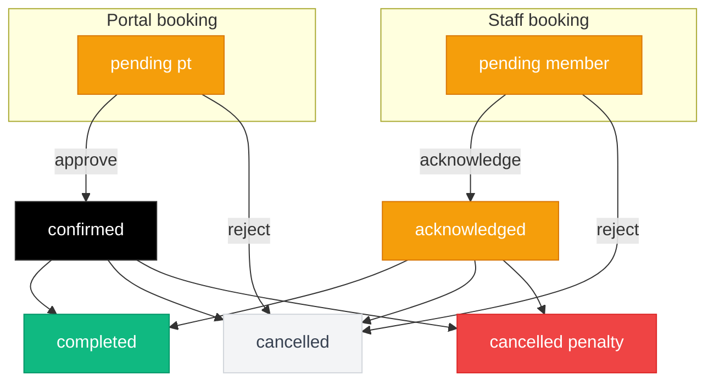

# Appointment

The appointment module manages training session bookings between members and trainers. It handles the full appointment lifecycle — creation with real-time slot availability, approval workflows for portal bookings, rescheduling, two types of cancellation (with and without penalty), compensation session tracking, and trainer check-in with late detection.

**Route:** `apps/admin/src/app/(staff)/appointments/page.tsx` (~1,069 lines) <br />
**Permission module:** `operations-appointment` (`can_view` for page access, `can_edit` for creating, modifying, and cancelling appointments)

## Data fetching

**Hook:** `src/hooks/use-appointments.ts`

Queries `view_4_3_appointment` with a nested join to resolve package names:

```
view_4_3_appointment + member_package:member_package_id (package:package_id (name))
```

**Role-based query filtering:**

| Role | Filter applied |
| --- | --- |
| Trainer | `trainer_id = currentStaffId` (sees only own appointments). |
| Admin / Super Admin (no filter) | No filter — sees all appointments. |
| Admin / Super Admin (with filter) | `trainer_id = selectedTrainerId` — optional trainer dropdown in the header. |

Results are ordered by `start_time` descending.

**Realtime subscription** on the `gym.appointment` table (channel: `appointment-changes`). On any change event (`INSERT`, `UPDATE`, `DELETE`), the hook re-fetches the full view to ensure joined data stays fresh.

### Data transformation

The hook maps `AppointmentViewRow` to `Appointment` UI objects:

- `customer_name` — resolves as `member_name ?? leads_name ?? 'Unknown'`.
- `location` — mapped from `branch`.
- `date`, `time` — formatted from `start_time` using `en-US` locale.
- `isUpcoming` / `isPast` — derived by comparing `start_time` to `new Date()`.
- Pass-through fields: `booking_source`, `category`, `branch`, `leads_id`, `leads_name`, `sent_reminder_count`, `cancelled_at`, `is_compensated`, `trainer_signed_attendance_at`.

## Page layout

```
┌──────────────────────────────────────────────────────────┐
│  [Trainer Filter (admin only)]  [Calendar|List]  [+ New] │
├──────────────────────────────────────────────────────────┤

Calendar view (default):
┌──────────────────────────────────────┬───────────────────┐
│  Month/Week/Day Calendar Grid        │  Selected Day      │
│  - Status-colored event chips        │  Appointment List   │
│  - Click day to select              │  with full actions  │
│  - Navigation arrows                │  [+ New Appointment]│
└──────────────────────────────────────┴───────────────────┘

List view:
┌─────────────────────────────────────────────────────────┐
│  Search · Status · Trainer · Package · Date Range       │
├─────────────────────────────────────────────────────────┤
│  Appointment Cards with inline actions                  │
└─────────────────────────────────────────────────────────┘
```

## Calendar view

**Component:** `src/components/ui/premium-calendar.tsx` (~2,388 lines)

The calendar is **custom-built from scratch** — no external calendar library. It uses React state to manage navigation and view switching.

### Three sub-views

| View | Layout | Navigation |
| --- | --- | --- |
| **Month** (default) | 6x7 grid (42 cells), padded with adjacent month dates. Each cell shows event chips with status-colored dots. | Previous/next month arrows. |
| **Week** | 7 days with appointment lists per day. | Previous/next week arrows. |
| **Day** | Single day with full appointment list. | Previous/next day arrows. |

The active tab is indicated by a red underline (`bg-[#e41e26]`).

### Event chip styles

| Status | Style |
| --- | --- |
| `pending pt` / `pending member` | `bg-red-50 border-red-200 ring-2 ring-red-100` |
| `confirmed` / `acknowledged` | `bg-gradient-to-br from-black to-gray-900 text-white` |
| `completed` | `bg-slate-50 border-slate-200` |
| `cancelled` | `bg-slate-50 border-slate-200 opacity-60` |
| `cancelled penalty` | `bg-red-50 border-red-300 opacity-60` |

### Calendar dot colors

Status indicator dots on day cells:

| Status | Dot color |
| --- | --- |
| `pending pt` / `pending member` | `bg-[#e41e26]` (red) |
| `confirmed` / `acknowledged` | `bg-black` |
| `completed` | `bg-slate-400` |
| `cancelled` | `bg-slate-300` |
| `cancelled penalty` | `bg-red-400` |

### Right sidebar

Clicking a day in the calendar selects it and reveals a right-side panel showing that day's appointments. Each card has the full set of action buttons (check-in, approve, reject, reschedule, cancel, compensate). A "New Appointment" button lets you create a session for the selected date.

### Calendar filters

A collapsible filter panel (toggled with a Filter button) offers: search text, status, trainer, package, and location filters. These use the same `APPOINTMENT_STATUSES` array as the list view.

### Realtime subscriptions

The calendar maintains realtime subscriptions on both the `appointment` and `trainer_schedule` tables (filtered by the selected trainer) to update availability and appointments live.

## List view

### Filters (all client-side)

| Filter | Options | Match logic |
| --- | --- | --- |
| **Search** | Free text | Matches `customer_name`, `trainer_name`, `package_name`. |
| **Status** | All statuses from `APPOINTMENT_STATUSES` | Exact match. |
| **Trainer** | Dropdown of trainer names | Matches `trainer_id`. |
| **Package** | Dropdown of unique package names | Exact match on `package_name`. |
| **Date** | All / Today / Upcoming / Past | Default: Today. Compares `start_time` to now. |

### Appointment card fields

Each card in the list displays:

- Time block (time + date).
- Customer name, status badge, package name badge.
- Trainer, phone, location (branch), timing indicator (Upcoming/Past).
- Description/notes (if present).
- Inline action buttons: Check In, Approve, Reject, Reschedule/Cancel dropdown, Compensate.

## Appointment statuses

Seven statuses track an appointment through its lifecycle:

| Status | Badge style | Meaning |
| --- | --- | --- |
| `pending pt` | Amber (warning) | Created from the portal. Awaits trainer approval. |
| `pending member` | Amber (warning) | Created by trainer/admin. Awaits member acknowledgment. |
| `confirmed` | Black (brand) | Trainer approved. Session is scheduled. |
| `acknowledged` | Amber (warning) | Member acknowledged a trainer-created booking. |
| `completed` | Green (success) | Session conducted. |
| `cancelled` | Gray (neutral) | Cancelled without penalty. Session may be returned/compensated. |
| `cancelled penalty` | Red (danger) | Cancelled with penalty. Session deducted. |

### Status transitions



**Transition rules enforced server-side:**

- `confirmed` can only come from `pending pt`.
- `acknowledged` can only come from `pending member`.
- Past appointments can't be cancelled.
- `completed`, `cancelled`, and `cancelled penalty` are terminal — no further changes.

## Creating an appointment

**Component:** `src/components/forms/new-appointment-form.tsx` (~1,529 lines)

The form can be opened from the page header, the calendar sidebar, or the members list page.

### Form fields

| Field | Required | Details |
| --- | --- | --- |
| **Member** | Yes | Searchable dropdown with avatar. Queries `view_4_1_2_member_package` for members with `package_status = 'active'` and `remaining_pt_session > 0`. Groups into "My Assigned Members" (star icon, green border) and "Other Members". |
| **Package** | Yes | Populated after member selection. Shows packages with remaining sessions. Active packages sorted first, then assigned-to-current-trainer first. Auto-selects if only one active package. |
| **Trainer** | Yes | Populated after package selection. Active staff in `trainer`, `admin`, or `super_admin` categories, filtered by branch. Shows "Package Trainer" badge on the assigned trainer. Auto-selects the package's trainer. |
| **Date** | Yes | Calendar picker. Past dates disabled. Dates outside the package period disabled. Dates where the trainer has a schedule are highlighted green (from `view_5_1_trainer_schedule`). |
| **Duration** | Yes | Select from 0.5h to 5h in 0.5h increments. Capped at the package's `remaining_sessions`. |
| **Start Time** | Yes | Populated after trainer + date + duration are set. Calls `/api/appointments/available-slots`. Shows slots in 30-minute increments with quick-tap chips (up to 8 visible, then "+N more"). |
| **End Time** | Auto | Calculated from start time + duration. Read-only. |
| **Remarks** | No | Free text textarea, 3 rows. |

### Trainer availability display

When you select a trainer and date:

- Calendar dates are highlighted green if the trainer has a schedule that day.
- Work hours display inline (e.g., "Work Hours: 9:00 AM - 6:00 PM") with break times listed.
- Package period is shown as a reference.

### Realtime during form

The form subscribes to both the `appointment` and `trainer_schedule` tables (filtered by the selected `trainer_id`). If another booking is made or a schedule changes while the form is open, available slots refresh automatically.

### Submit flow

1. Validate all required fields.
2. Run Zod `appointmentFormStateSchema` validation (end time after start time, start time in the future).
3. Insert into the `appointment` table with `status: 'confirmed'`.
4. Refresh the appointment list.

:::note
Appointments created manually by staff are inserted as `confirmed` — they bypass the pending approval workflow. Only portal bookings start as `pending pt`.
:::

## Trainer availability algorithm

**File:** `src/lib/validations/appointment-availability.ts`

Two exported functions power availability:

### `getAvailableTimeSlots(trainerId, date, excludeId?)`

1. Fetch schedule rows for the trainer and date from `view_5_1_trainer_schedule`.
2. For each row: if no `out_from`/`out_to` (blocked periods), the entire window is available. Otherwise, split the window around the blocked period.
3. Fetch booked appointments for that trainer and date (statuses: `pending pt`, `pending member`, `confirmed`, `acknowledged`, `completed`). Optionally exclude one appointment ID (for rescheduling).
4. Subtract booked time ranges from available windows.
5. Return the remaining free slot array.

### `validateTrainerAvailability(trainerId, start, end, excludeId?)`

Checks whether a specific time range is valid:

- Queries `view_5_1_trainer_schedule` for the date.
- Verifies the appointment falls within the schedule window.
- Checks for blocked periods (`out_from`/`out_to`).
- Checks for conflicting appointments.

Returns a `conflictType` on failure: `'no_schedule'`, `'outside_window'`, `'blocked_time'`, `'no_availability'`, or `'appointment_conflict'`.

## Actions

### Approve

- **Visible on:** `pending pt` upcoming appointments.
- **Flow:** Calls `PATCH /api/appointments/[id]/status` with `{ status: 'confirmed' }`.
- **Server validation:** `validateTrainerAvailability()` runs before the update — approval fails if the slot is no longer available.
- **Authorization:** Admins can approve any. Trainers can approve only their own.

### Reject

- **Visible on:** Same as Approve (shown alongside the Approve button).
- **Flow:** Opens `CancelConfirmationDialog` (configured with title "Reject Appointment"). On confirm, calls the status endpoint with `{ status: 'cancelled', reason }`.
- **Compensation:** Not offered for rejection.

### Cancel

- **Visible on:** Upcoming, non-completed/cancelled appointments.
- **Flow:** Opens `CancelConfirmationDialog` with a penalty toggle and optional compensation checkbox.
- **Two types:** Regular cancel (`cancelled`) or penalty cancel (`cancelled penalty`). See [Cancellation system](#cancellation-system) below.

### Reschedule

- **Visible on:** Upcoming, non-completed/cancelled appointments.
- **Flow:** Fetches the appointment with package dates, then opens `RescheduleModal`.
- **Modal features:** Date picker, duration select, start time slots from `/api/appointments/available-slots`. Supports `skipScheduleValidation` (used when rescheduling due to schedule deletion) and `constrainToSchedule` (used during schedule editing).
- **API:** `PATCH /api/appointments/[id]` with `{ start_time, end_time, addCompensation, skipScheduleValidation }`.
- Records `rescheduled_from`, `rescheduled_by`, and `rescheduled_at` on the appointment.

### Check in

- **Visible on:** `confirmed` or `acknowledged` appointments within the past 30 days to today.
- **Flow:** Calls `submitTrainerCheckIn(appointmentId)` directly via the Supabase browser client.
- **What it sets:** `trainer_signed_attendance_at = now`. Also sets `member_signed_attendance_at = now` only if the member hasn't already checked in (preserves portal check-in time).
- **Late detection:** If `start_time < now`, the button shows "Late Check In" instead of "Check In". This is a visual indicator only — it doesn't block the action.
- **After check-in:** The button is replaced by a green "Checked In \{time\}" badge.

### Compensate (retroactive)

- **Visible on:** `cancelled` appointments (not `cancelled penalty`) that have a package, are within 30 days of `cancelled_at`, and aren't already compensated.
- **Flow:** Opens `AddCompensationDialog` showing days since cancellation. Calls `PATCH /api/appointments/[id]/compensation` with `{ is_compensated: true }`.
- **After compensation:** A "Compensated" badge with a check icon appears.

## Cancellation system

The cancellation dialog supports two types, toggled by a switch:

| Type | Status value | Session effect | Compensation option |
| --- | --- | --- | --- |
| **Regular cancel** | `cancelled` | Session returned to the member's package. | Yes — optional +1 compensation checkbox. |
| **Penalty cancel** | `cancelled penalty` | Session deducted as penalty (e.g., last-minute no-show). | No — checkbox hidden when penalty is on. |

### Data stored on cancellation

| Field | Value |
| --- | --- |
| `status` | `'cancelled'` or `'cancelled penalty'` |
| `cancelled_by` | Staff ID of the person who cancelled |
| `cancelled_at` | ISO timestamp |
| `remark` | Existing remark + `"\n[Cancelled: \{reason\}]"` or `"\n[Cancelled with Penalty: \{reason\}]"` |
| `is_compensated` | `true` if compensation was added at the time of cancellation |

### Cancel dialog fields

- **Penalty toggle** (Switch) — switches between regular and penalty cancellation.
- **Compensation checkbox** — visible only when penalty is off and the appointment has a package.
- **Reason** (required) — textarea, max 500 characters.

## Compensation sessions

There are two mechanisms for adding compensation, depending on the context:

### Single appointment compensation (`is_compensated` flag)

Used for individual cancellations and retroactive compensation:

- The `is_compensated` boolean on the `appointment` row is set to `true`.
- The view `view_4_1_2_member_package` reads these flags and computes total compensation count.
- Can be toggled via `PATCH /api/appointments/[id]/compensation`.

**Eligibility (from `compensation-utils.ts`):**

- Status must be `cancelled` (not `cancelled penalty`).
- Appointment must have a `member_package_id`.
- `is_compensated` must not already be `true`.
- Must be within 30 days of `cancelled_at` (`MAX_DAYS_AFTER_CANCELLATION = 30`).
- Server-side: package must have `package_status = 'active'`.

### Bulk cancel compensation (direct increment)

Used by the bulk cancel API when schedule changes affect multiple appointments:

- Directly increments `member_package.compensation_session` integer field.
- This is a different mechanism from the single-appointment `is_compensated` flag.

## Bulk cancel

**Route:** `POST /api/appointments/bulk-cancel`

Used when trainer schedule changes (blocking/deleting slots) affect existing appointments.

**Request body:**

```json
{
  "cancellations": [
    { "appointmentId": "uuid", "addCompensation": true }
  ],
  "reason": "Schedule change"
}
```

**Processing:**

1. Fetches all appointment IDs in a single query.
2. Skips appointments already `cancelled` or `completed`.
3. For each valid appointment: sets `status = 'cancelled'`, `cancelled_by`, `cancelled_at`, appends reason to `remark`.
4. If `addCompensation` and the appointment has a `member_package_id`: increments `compensation_session` on the `member_package` table.
5. Authorization: admins can cancel any. Trainers can only cancel their own.

**Response includes:** `cancelledCount`, `compensatedCount`, `failedCount`, and detailed arrays for each.

## Check-in system

### Eligibility (`canCheckInAppointment`)

- Appointment status must be `confirmed` or `acknowledged`.
- Appointment date must be between 30 days ago and today (inclusive).
- Admins can check in any appointment. Trainers can only check in their own.

### Late detection (`isLateCheckIn`)

Returns `true` if the appointment's `start_time` has already passed. The button text changes to "Late Check In" but the action isn't blocked.

### Check-in flow (`submitTrainerCheckIn`)

1. Fetch the appointment's current `member_signed_attendance_at`.
2. Set `trainer_signed_attendance_at = now` (always).
3. Set `member_signed_attendance_at = now` only if it's currently `null` (preserves the member's own portal check-in time).
4. Timestamps are stored as UTC ISO strings and displayed in the browser's local timezone.

## Portal booking integration

When a member books a session from the portal (`apps/portal/src/app/(protected)/schedule/book/page.tsx`), the appointment is inserted with:

- `status: 'pending pt'` — always requires trainer approval.
- `booking_source: 'manual'`, `category: 'member'`.
- `branch`: from the member's branch.

Portal bookings appear in the admin calendar/list immediately via the realtime subscription, showing the amber "Pending PT" badge until a trainer approves or rejects them.

## Trainer schedule connection

Trainer availability flows from the schedule module into appointment booking:

1. Trainers define weekly schedules in the `trainer_schedule` table.
2. `view_5_1_trainer_schedule` expands those recurring schedules into per-date rows, including exclusion periods (`out_from`/`out_to` for breaks and time-off).
3. The new appointment form queries this view to highlight available dates in the calendar picker.
4. `/api/appointments/available-slots` calls `getAvailableTimeSlots()`, which builds free time ranges from the schedule view, then subtracts already-booked appointment times.
5. Time slots are offered in 30-minute increments within the remaining free ranges.
6. The approval endpoint re-validates against this view before confirming a booking.

## API routes

| Route | Method | Purpose |
| --- | --- | --- |
| `/api/appointments/[id]` | GET | Fetch a single appointment from `view_4_3_appointment`. |
| `/api/appointments/[id]` | PATCH | Reschedule — update `start_time`, `end_time`. Records reschedule metadata. Supports `skipScheduleValidation`. |
| `/api/appointments/[id]/status` | PATCH | Change status (approve, reject, cancel). Enforces transition rules. Sets cancellation metadata. |
| `/api/appointments/[id]/compensation` | PATCH | Toggle `is_compensated` flag. Validates eligibility (active package, within 30 days). |
| `/api/appointments/available-slots` | GET | Returns available time slots for a trainer on a date. Params: `trainer_id`, `date`, `exclude_appointment_id`. |
| `/api/appointments/validate-availability` | GET | Validates a specific time slot. Returns `isValid` and `conflictType`. |
| `/api/appointments/bulk-cancel` | POST | Cancel multiple appointments. Supports per-appointment compensation. |

## Validation

**File:** `src/lib/validations/appointment.ts`

### Zod schemas

| Schema | Purpose |
| --- | --- |
| `appointmentSchema` | Base schema with all appointment fields. |
| `createAppointmentSchema` | Extends base — refines that end time > start time and start time is in the future. |
| `appointmentFormStateSchema` | Same refinements, used by `NewAppointmentForm`. |
| `cancelAppointmentSchema` | `reason` string, 1-500 characters. |

### Enum values in validation

| Field | Values |
| --- | --- |
| **Status** | `pending pt`, `pending member`, `confirmed`, `acknowledged`, `cancelled`, `completed` |
| **Branch** | `kota damansara`, `kepong`, `all branch` |
| **Booking source** | `manual`, `bot` |
| **Category** | `leads`, `member` |

### Helper functions

- `isInPast(dateTimeStr)` — checks if a datetime has passed.
- `timeRangesOverlap(start1, end1, start2, end2)` — checks for time range overlap.
- `parseTimeToHours(timeStr)` — converts `HH:MM:SS` to decimal hours.
- `isWithinScheduleWindow(aptStart, aptEnd, schedStart, schedEnd)` — checks if an appointment falls within a schedule window.

## Database views and tables

| Source | Purpose |
| --- | --- |
| `view_4_3_appointment` (view) | Main appointment listing. Joins member names, trainer names, branch, booking source, leads info, and attendance timestamps. |
| `view_5_1_trainer_schedule` (view) | Trainer availability per date. Expands recurring schedules with exclusion periods. Used for slot calculation and date highlighting. |
| `view_4_1_2_member_package` (view) | Member packages with `remaining_pt_session`, `package_status`, `compensation_session`. Used in the new appointment form and compensation validation. |
| `view_2_member` (view) | Member basic info. Used in the new appointment form member search. |
| `appointment` (table) | Core appointment records. Write target for create, reschedule, status change, check-in, and compensation. Realtime subscription target. |
| `member_package` (table) | Package records. Updated directly for bulk cancel compensation (`compensation_session` increment). |
| `trainer_schedule` (table) | Trainer weekly schedules. Realtime subscription target in the form and calendar. |
| `staff` (table) | Trainer and staff lookup for the form and authorization checks. |

### RPC function

- `update_appointment_skip_validation` — updates an appointment's time without triggering the database's schedule validation. Used when rescheduling due to schedule changes where the old slot no longer exists.

## Component files

| File | Purpose |
| --- | --- |
| `appointments/page.tsx` | Page with calendar/list toggle, trainer filter, modal orchestration. |
| `ui/premium-calendar.tsx` | Custom calendar with month/week/day views, event chips, sidebar panel (~2,388 lines). |
| `forms/new-appointment-form.tsx` | Appointment creation with member/package/trainer cascading selects, realtime slot availability (~1,529 lines). |
| `appointments/reschedule-modal.tsx` | Date picker + available slot selection for rescheduling. Realtime subscriptions for live availability. |
| `appointments/cancel-confirmation-dialog.tsx` | Shared dialog for cancel and reject. Penalty toggle, compensation checkbox, reason input. |
| `appointments/add-compensation-dialog.tsx` | Retroactive compensation dialog. Shows days since cancellation. 30-day limit. |
| `hooks/use-appointments.ts` | Appointment list fetch, realtime subscription, role-based filtering, client-side filter function. |
| `lib/validations/appointment.ts` | Zod schemas, status options array, time range helpers. |
| `lib/validations/appointment-availability.ts` | `getAvailableTimeSlots()` and `validateTrainerAvailability()` — slot computation and conflict detection. |
