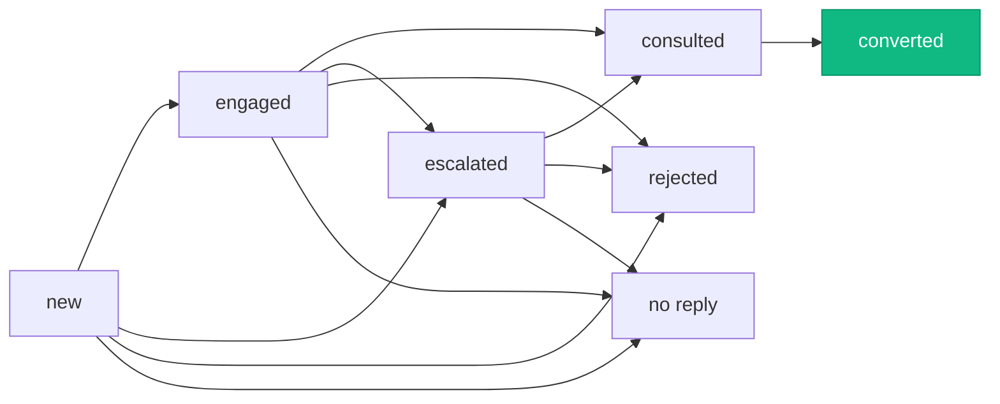

# Leads

The leads module tracks prospective gym members from first contact through to conversion. It handles the full sales pipeline — creating leads from marketing channels, following up with remarks, importing leads in bulk, and converting them into registered members.

**Route:** `apps/admin/src/app/(staff)/leads/page.tsx` <br />
**Permission module:** `leads` (`can_view` for list access, `can_edit` for CRUD + import, `can_export` for CSV export)

## Data fetching

### List data

**Hook:** `src/hooks/use-leads.ts`

The leads list uses `useState` + `useEffect` with a **Supabase Realtime subscription** on the `gym.leads` table. Changes (insert, update, delete) are applied to the local state instantly without re-fetching the full list.

```ts
channel("leads-changes")
  .on("postgres_changes", { event: "*", schema: "gym", table: "leads" }, handler)
```

The realtime handler applies branch filtering — leads with a `null` branch or `"all branch"` are visible to all staff, while branch-specific leads are only visible to matching staff.

**Source view:** `view_3_leads` — joins lead data with computed fields like `latest_remark`, `follow_up_count`, and `remark`.

:::note
`view_3_leads` can return duplicate rows due to member joins. The hook deduplicates by ID after fetching.
:::

### Detail data

**Hook:** `src/hooks/use-lead-details.ts`

Fetches a single lead and its remarks in parallel via `GET /api/leads/[id]` and `GET /api/leads/[id]/remarks`. Includes optimistic state updates for remarks — new remarks appear immediately without re-fetching.

## Page layout

```
┌─────────────────────────────────────────────────────────────┐
│  Search · Status Filter · Follow-up Filter · Branch Filter  │
│  Date Range · [New Lead] · [Import/Export] · [Templates]    │
├─────────────────────────────────────────────────────────────┤
│  Stats: Total Leads · Follow-up Required (red)              │
├─────────────────────────────────────────────────────────────┤
│  Lead Table (paginated, 20 per page)                        │
│  → Click row to open Lead Detail Modal                      │
├─────────────────────────────────────────────────────────────┤
│  Pagination Controls                                        │
└─────────────────────────────────────────────────────────────┘
```

## Filters

All filtering is **client-side**, applied to the full list returned by `useLeads`:

| Filter | Options | Match logic |
| --- | --- | --- |
| **Search** | Free text | Matches against name, contact, branch, source, source channel, and ID (case-insensitive). |
| **Status** | All / New / Engaged / Escalated / Rejected / No Reply / Consulted / Converted | Exact match on `status` field. Per-status counts shown as badges. |
| **Follow-up** | All / Required / Not Required | Matches `require_follow_up` boolean. |
| **Branch** | All / Kepong / Kota Damansara | Exact match on `branch`. Single-branch staff are locked to their branch. |
| **Date range** | Presets + custom | Filters by `created_at`. Defaults to "This Month" on page load. |

## Table columns

| Column | Responsive | Content |
| --- | --- | --- |
| **Lead Info** | Always visible | Avatar initials, name, short ID, contact, branch. |
| **Contact** | md+ | Phone number. |
| **Source** | lg+ | Source text + channel sub-label. |
| **Status** | Always visible | Inline dropdown to change status (locked badge if converted). |
| **Follow Up** | Always visible | Pill with count badge — red if required, grey otherwise. |
| **Latest Remark** | xl+ | Truncated at 50 chars with tooltip for full text. |
| **Created** | lg+ | Date and time on two lines. |

The Status column header includes an info tooltip with the full status legend.

## Status workflow

Seven statuses track a lead's journey through the sales pipeline:

| Status | Color | Meaning |
| --- | --- | --- |
| `new` | Black | First contact received. |
| `engaged` | Amber | Lead has acknowledged contact; bot advised offline consultation. |
| `escalated` | Amber | Assigned to a staff member for follow-up. |
| `rejected` | Red | Declined to visit for consultation. |
| `no reply` | Grey | No response after follow-up attempts. |
| `consulted` | Green | Completed an offline consultation session. |
| `converted` | Green | Registered as a member. **Permanently locked — cannot be changed back.** |

### Status change flow

1. Staff clicks the status badge in the table row — a dropdown opens.
2. For any status except "converted": calls `PATCH /api/leads/[id]/status` immediately.
3. For "converted": an alert dialog warns that the action is **permanent** and will redirect to the member registration form.
4. On confirm: the app redirects to `/members/new?from=lead&leadId=X&name=Y&contact=Z&source=A&branch=B` with pre-filled data.
5. The member registration page creates the member, then calls the status API to mark the lead as converted.
6. The server sets `converted_at` to the current timestamp.
7. The lead record is **not deleted** — it stays in the table with a locked status badge.



:::warning
Converting a lead is a one-way action. The status changes to "converted," `converted_at` is set, and the dropdown is permanently disabled for that lead.
:::

## Lead detail modal

Opens as a large dialog (`max-w-5xl` to `max-w-6xl`) when a table row is clicked. Fetches lead details and remarks in parallel.

### View mode

- Avatar with initials, name, status badge, follow-up badge.
- Info grid (2 columns): Contact, Branch, Source, Channel, Created date/time, Follow Up Count.

### Edit mode

Requires `can_edit` permission. Opens an inline edit panel with a red accent border.

| Field | Editable | Validation |
| --- | --- | --- |
| Full Name | Yes | Required, min 2 characters. |
| Source | Yes | Free text. |
| Branch | Yes | Select, filtered to accessible branches. |
| Channel | Yes | Select from `SOURCE_CHANNELS` enum. |
| Contact | **No** | Read-only in the modal. |

Saves via `PATCH /api/leads/[id]`.

## Remarks system

Remarks are timestamped notes added by staff (or by the AI bot from WhatsApp conversations) on a lead's record.

**Database table:** `lead_remarks` — fields: `id`, `lead_id`, `remark`, `created_by` (staff UUID, nullable for bots), `created_at`, `is_bot`.

### Display

- Ordered newest first.
- Staff remarks show a User icon with the staff member's name.
- Bot remarks show a Bot icon, "AI Bot" label, grey "Bot" badge, and a grey background.

### Permissions

| Action | Who can do it |
| --- | --- |
| Add remark | Any staff with `can_edit`. Submit with button or **Ctrl+Enter**. Max 2,000 chars. |
| Edit remark | Only the staff member who created it. Bot remarks cannot be edited (403). |
| Delete remark | Only the staff member who created it. Bot remarks cannot be deleted (403). Two-step inline confirmation. |

## Lead creation

The **New Lead** modal (`new-lead-modal.tsx`) has these fields:

| Field | Required | Details |
| --- | --- | --- |
| Full Name | Yes | Min 2 characters. |
| Phone Number | Yes | Country code select (+60, +65, +62, +66, +63) + number input (digits only). |
| Branch | No | Defaults to "No Branch (Visible to All)". Auto-set for single-branch staff. |
| Source Channel | Yes | Select from `SOURCE_CHANNELS` enum. |
| Initial Remark | No | Free text textarea. |

### Duplicate detection

Real-time duplicate checking runs when the phone number reaches 10+ digits (debounced 500ms):

- Calls `GET /api/leads/check-phone` with multiple phone format variations.
- **Existing member found** → Red warning, submit button disabled.
- **Existing lead found** → Amber warning, submit button disabled.
- Uses the admin client (service role) to bypass RLS.

All new leads are created with `require_follow_up: true` by default.

## Import and export

### CSV import

A two-step wizard in `lead-import-export.tsx`:

**Step 1 — Template:**
- Download a CSV template with example data.
- Column guide showing required vs optional fields.

**Step 2 — Preview:**
- Client-side CSV parsing with statistics: Ready / Warnings (will import) / Invalid (skipped).
- Preview table with per-row error/warning highlighting.
- Duplicate detection within the batch and against existing leads and members.

**CSV columns:** `name` (required), `contact` (required), `source`, `source_channel`, `status`, `scoring`, `require_follow_up`, `remark`, `branch`.

**Phone handling:** Strips Excel formula format (`="601..."`) , scientific notation (`6.01E+11`), and leading apostrophes (`'601...`). Validates with `libphonenumber-js`.

**Validation:** Rows with invalid `source_channel`, `status`, or `branch` values are skipped. Branch access is enforced — staff can't import leads into branches they don't have access to.

**Permission:** Requires `can_edit` (import shares the edit permission).

### CSV export

`GET /api/leads/export` returns a CSV download with the current filter state passed as query params.

**Columns:** ID, Name, Contact (as Excel formula to prevent scientific notation), Source, Source Channel, Status, Scoring, Require Follow Up, Follow Up Count, Remark, Branch, Created At, Converted At.

**Permission:** Requires `can_export` (separate from `can_edit`).

## Message source templates

Templates map incoming WhatsApp message keywords (promo codes) to a source name and channel for **automatic lead attribution**. When a lead messages with a known keyword, the bot auto-assigns their source.

**Database table:** `message_source_template` — fields: `id`, `source`, `source_channel`, `keywords` (text array), `branch`, `status`, `created_at`.

### Template management dialog

| Mode | What it shows |
| --- | --- |
| **List** | Source, Channel, Branch, Promo Codes (as badges, max 4 shown + overflow count), Status toggle, Edit button. Client-side pagination (10 per page). |
| **Add** | Form: Source Channel (required), Branch (required), Source Name (required), Status, Promo Codes (tag input, at least 1, lowercase). |
| **Edit** | Same form, pre-filled with existing values. |

**API:** `GET/POST/PATCH/DELETE /api/leads/message-source-templates`. Delete is a soft delete (sets `status = "inactive"`).

**Branch scoping:** Single-branch staff see templates for their branch + "all branch" templates. "All branch" staff see everything.

## Source channels

Two fields track where a lead came from:

| Field | Type | Purpose |
| --- | --- | --- |
| `source` | Free text | Campaign name (e.g., "Christmas Buy 10 Free 1"). |
| `source_channel` | Enum | Marketing channel. The primary analytics dimension for tracking ROI. |

**Available channels:** `facebook`, `facebook/instagram`, `instagram`, `google`, `website`, `walk in`, `br`, `xhs` (Xiaohongshu), `referral`, `flier`, `call in`.

## API routes

| Route | Method | Purpose |
| --- | --- | --- |
| `/api/leads` | POST | Create a new lead. |
| `/api/leads/[id]` | GET | Get a single lead by ID. |
| `/api/leads/[id]` | PATCH | Update lead fields (name, source, branch, channel). |
| `/api/leads/[id]/status` | PATCH | Change lead status. Sets `converted_at` for conversions. |
| `/api/leads/[id]/remarks` | GET | Get all remarks for a lead (with staff names joined). |
| `/api/leads/[id]/remarks` | POST | Add a remark. |
| `/api/leads/[id]/remarks` | PUT | Update own remark. |
| `/api/leads/[id]/remarks` | DELETE | Delete own remark. |
| `/api/leads/export` | GET | Export filtered leads as CSV. |
| `/api/leads/import` | POST | Bulk import leads from CSV. |
| `/api/leads/check-phone` | GET | Check for duplicate phone numbers. |
| `/api/leads/message-source-templates` | GET, POST, PATCH, DELETE | Template CRUD. |

## Database views and tables

| Source | Purpose |
| --- | --- |
| `leads` (table) | Core lead records. Realtime subscription target. |
| `lead_remarks` (table) | Staff and bot remarks on leads. |
| `message_source_template` (table) | Promo code → source channel mapping for auto-attribution. |
| `view_3_leads` (view) | Leads with computed `latest_remark`, `follow_up_count`. Used for list and detail. |
| `view_3_1_leads_remark` (view) | Lead remarks with joins. |
| `view_1_1_cost_per_lead` (view) | Feeds analytics — cost per lead by channel. |
| `view_1_2_monthly_conversion_report` (view) | Feeds analytics — monthly conversion rates. |
| `view_1_3_leads_status_distribution` (view) | Feeds analytics — status breakdown per channel. |

## Component files

| File | Purpose |
| --- | --- |
| `leads/page.tsx` | Page entry. Filter state, pagination, summary stats, modal orchestration. |
| `leads/lead-header.tsx` | Search bar, filter dropdowns, action buttons (new, import, templates), stats. |
| `leads/lead-table.tsx` | Data table with responsive column visibility and inline status editing. |
| `leads/lead-detail-modal.tsx` | Detail view, inline edit panel, remarks list with CRUD. |
| `leads/lead-status-select.tsx` | Inline status dropdown with conversion confirmation dialog. |
| `leads/lead-import-export.tsx` | Two-step CSV import wizard and export trigger. |
| `leads/new-lead-modal.tsx` | New lead creation form with duplicate detection. |
| `leads/message-source-template-dialog.tsx` | Template list, add, and edit dialog. |
| `leads/date-range-filter.tsx` | Preset and custom date range picker. |
| `hooks/use-leads.ts` | List data + Supabase Realtime subscription. |
| `hooks/use-lead-details.ts` | Single lead + remarks fetching with optimistic updates. |
| `hooks/use-message-source-templates.ts` | Template list fetching. |
| `lib/validations/lead.ts` | Zod schemas for all lead operations. |
| `lib/leads-helpers.ts` | Formatting utilities. |
| `types/leads.ts` | TypeScript interfaces. |
