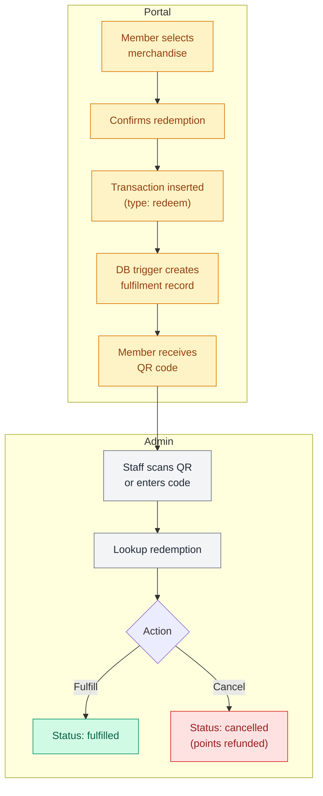

# Point system

The point system rewards members with points for completing sessions, purchasing packages, and renewing early. Members redeem points for merchandise through the portal, receiving a QR code that staff scan in the admin app to fulfil. The module includes a configurable rules engine, a merchandise catalog, transaction tracking, and manual point adjustments.

**Route:** `apps/admin/src/app/(staff)/operations/point-system/page.tsx` (~219 lines) <br />
**Permission module:** `operations-point-system` (`can_view` for page access, `can_edit` for adjustments, fulfilment, config changes, and merchandise management)

## Data fetching

The point system has **no dedicated admin-side hooks** and **no API routes**. All admin components query the Supabase browser client directly using `useCallback` + `useEffect` patterns (not SWR).

The portal side uses SWR hooks with realtime subscriptions.

There are **no Zod validation schemas** — validation is done inline in each component.

:::note
The point system is one of two modules (along with trainer schedule) where all CRUD operations go directly through the Supabase browser client with no API route layer.
:::

## Page layout

```
┌──────────────────────────────────────────────────────────┐
│  Point System                                             │
│  Total Earned: 12,450  Redeemed: 3,200  Pending: 5       │
├──────────────────────────────────────────────────────────┤
│  [Transactions] [Member Points] [Config] [Merchandise]    │
├──────────────────────────────────────────────────────────┤
│  Active tab content                                       │
└──────────────────────────────────────────────────────────┘
```

### Overview stats

Three stat pills in the header (fetched on mount from `member_points_transaction` and `member_points_redeemption_fulfilment`):

| Stat | Color | Source |
| --- | --- | --- |
| **Total Earned** | Emerald | Sum of earn transactions. |
| **Total Redeemed** | Amber | Sum of redeem transactions. |
| **Pending To Fulfill** | Rose (animated) | Count of fulfilment records with `status = 'pending'`. Only shown when count > 0. |

## Transaction types

The `point_transaction_type` enum has exactly two values: `earn` and `redeem`.

There's no separate type for manual adjustments — admin adjustments reuse `earn` or `redeem` and are distinguished by null `merchandise_id` and `points_config_id`.

| Scenario | Type | `merchandise_id` | `points_config_id` | Remark |
| --- | --- | --- | --- | --- |
| Session completion | `earn` | null | Populated | Auto-set. |
| Package purchase | `earn` | null | Populated | Auto-set. |
| Early renewal bonus | `earn` | null | Populated | Auto-set. |
| Merchandise redemption | `redeem` | Populated | null | "Merchandise redemption". |
| Manual add (admin) | `earn` | null | null | Admin-entered. |
| Manual deduct (admin) | `redeem` | null | null | Admin-entered. |

## Transactions tab

**Component:** `src/components/point-system/transactions-tab.tsx` (~703 lines)

Views and manages all point transactions across all members.

### Data source

`view_6_2_member_points_transaction` — ordered by `created_at` descending. Branch filtering is applied server-side. All other filters are client-side.

### Filters

| Filter | Options |
| --- | --- |
| **Search** | Matches member name or ID. |
| **Type** | All / Earn / Redeem. |
| **Status** | All / Pending / Fulfilled / Cancelled. |
| **Branch** | Disabled and pre-set for single-branch staff. |

Pagination: 20 items per page.

### Table columns

| Column | Content |
| --- | --- |
| **Date** | Transaction timestamp. |
| **Member** | Avatar + name + ID. |
| **Type** | Earned (emerald badge) or Redeemed (amber badge). |
| **Description** | Merchandise name, `points_description`, or `remark`. Redemption code shown in monospace if present. |
| **Points** | +/- value. |
| **Balance After** | Running balance. |
| **Status** | Pending / Fulfilled / Cancelled badge. Only shown for redeem transactions. |
| **Actions** | Verify button for pending redemptions (requires `can_edit`). |

### QR scan workflow

The Verify action supports two modes:

| Mode | How it works |
| --- | --- |
| **Camera** | Uses a `QRScanner` component. Scans the member's QR code. |
| **Manual** | Text input for the redemption code (format: `RPT-YYMMDDXXXX`). Auto-uppercased. |

Both modes call `lookupRedemptionCode(code)` which queries `view_6_2_member_points_transaction` by `redemption_code`. If the status is not pending, a toast is shown and the scanner resumes. If pending, the fulfilment modal opens.

### Fulfilment actions

Updates the `member_points_redeemption_fulfilment` record:

| Action | What it sets |
| --- | --- |
| **Fulfill** | `status: 'fulfilled'`, `fulfilled_at: now`, `last_updated_at: now`. |
| **Cancel** | `status: 'cancelled'`, `fulfilled_at: null`, `last_updated_at: now`. Points are effectively refunded (the view excludes cancelled redemptions from balance). |

Cancel requires confirmation via an alert dialog showing the points amount and member name.

## Member points tab

**Component:** `src/components/point-system/member-points-tab.tsx` (~502 lines)

Shows all members' point balances and lifetime stats.

### Data source

`view_6_1_member_points` — ordered by `balance_points` descending. This view includes **all members**, not just those with point activity.

### View columns

| Column | Content |
| --- | --- |
| **member_id** | Member ID. |
| **member_name** | Member name. |
| **member_branch** | Branch. |
| **balance_points** | Current spendable balance (excludes cancelled redemptions). |
| **ltv_earned_all_points** | Lifetime total earned. |
| **ltv_earned_session_points** | Earned from sessions. |
| **ltv_earned_purchase_points** | Earned from purchases. |
| **ltv_earned_renewal_points** | Earned from renewals. |
| **ltv_spent_points** | Lifetime total spent. |
| **ltv_redeem_merchandise_count** | Number of merchandise redemptions. |

### Table columns

| Column | Content |
| --- | --- |
| **Member** | Avatar + name + ID. |
| **Branch** | Branch badge. |
| **Balance** | Current points (amber, bold). |
| **Lifetime Earned** | Total earned (emerald). |
| **Lifetime Spent** | Total spent (rose). |
| **Redemptions** | Count of merchandise redemptions. |
| **Actions** | Adjust button (requires `can_edit`). |

Pagination: 20 items per page. Search by member name or ID (client-side).

### Manual point adjustment

The Adjust button opens a modal with:

| Field | Details |
| --- | --- |
| **Type** | "Add Points" (`earn`, emerald) or "Deduct Points" (`redeem`, rose). |
| **Points** | Integer input, minimum 1. Shows live "New Balance" preview. |
| **Remark** | Required textarea. |

**Validation:**

- Points must be greater than 0.
- Remark must not be empty.
- Balance can't go below 0 (checked client-side).

**On submit:** Inserts directly into `member_points_transaction` with `balance_before` and `balance_after` set explicitly. `merchandise_id` and `points_config_id` are left null.

## Config tab

**Component:** `src/components/point-system/points-config-tab.tsx` (~302 lines)

Configures point earning rules per branch.

### Data source

`points_config` table — ordered by `rule_key` then `branch`.

### Configurable rules

| Rule key | Label | Description |
| --- | --- | --- |
| `session_points` | Session Points | Points per completed PT session. |
| `purchase_rate` | Purchase Rate | Points per RM spent on package purchase. |
| `early_renewal_bonus` | Early Renewal Bonus | Bonus points for early package renewal. |

Rules are configured **per branch** — multiple rows per rule key, one per branch. Displayed as separate sections with branch badge headers.

### Editing

- **Value edit:** Inline number input. A Save button appears only when the value has been modified. Updates `rule_value` and `last_updated_at` on the `points_config` table.
- **Status toggle:** Switch between `active` and `inactive`. Presumably only active rules are applied by the database-side point earning logic.

### Branch scoping

Branch-specific staff only see their branch's configs (server-side filter). Multi-branch staff see all branches.

## Merchandise tab

**Component:** `src/components/point-system/merchandise-tab.tsx` (~690 lines)

Manages the reward catalog.

### Data source

`merchandise` table — ordered by `name` ascending.

### Form fields (create and edit)

| Field | Required | Details |
| --- | --- | --- |
| **Name** | Yes | Text input. |
| **Description** | No | Textarea. |
| **Points Required** | Yes | Integer, must be greater than 0. |
| **Category** | No | Select: `apparel`, `accessories`, `supplements`, `equipment`, `other`. |
| **Branch** | No | Select: `kota damansara`, `kepong`, `all branch`. Locked for single-branch staff. |
| **Image** | No | Upload to Supabase Storage (`merchandise-images` bucket, path: `merchandise/\{timestamp\}-\{random\}.\{ext\}`). |
| **Active** | No | Toggle. "Show in member catalog." |

### Display

Responsive card grid (`sm:grid-cols-2 lg:grid-cols-3 xl:grid-cols-4`). Each card shows the image, name, points cost, category badge, and branch badge. Inactive items have 60% opacity with an "Inactive" overlay badge.

### Active toggle

Inline switch on each card. Updates `is_active` and `last_updated_at` directly.

## Redemption flow

The full redemption lifecycle spans the portal and admin apps:



### Redemption code

Format: `RPT-YYMMDDXXXX` — auto-generated by a database trigger when a redeem transaction is inserted. Stored in both `member_points_transaction.redemption_code` and `member_points_redeemption_fulfilment.redemption_code`.

### Fulfilment statuses

| Status | Meaning |
| --- | --- |
| `pending` | Redeemed, awaiting staff fulfilment. |
| `fulfilled` | Staff confirmed the merchandise was collected. |
| `cancelled` | Staff cancelled. Points are effectively refunded (excluded from balance calculation). |

### Database trigger

When a `redeem` transaction is inserted into `member_points_transaction`, a database trigger automatically creates a `member_points_redeemption_fulfilment` record with `status = 'pending'` and a generated `redemption_code`. No application code creates this record directly.

## Point balance calculation

The `view_6_1_member_points` view computes `balance_points` by summing all earn transactions and subtracting all redeem transactions **except cancelled ones**. This means cancelling a redemption effectively refunds the points without creating a separate earn transaction.

Points **do not expire**. There's no expiry date field or time-based expiry logic anywhere in the schema.

## Portal integration

### Points page

**Route:** `/profile/points`

Shows the member's current balance in a gradient amber card, an informational earn card, a link to the rewards catalog, and a transaction history with infinite scroll (15 items per page via `useSWRInfinite`, `IntersectionObserver` sentinel).

Each transaction shows: icon (arrow up/down), remark, date, points (+/-), and balance after. Cancelled redemptions display at 50% opacity with strikethrough points and a "Cancelled" label.

### Rewards page

**Route:** `/profile/points/rewards`

Two tabs:

| Tab | Content |
| --- | --- |
| **Catalog** | 2-column grid of merchandise cards. Items the member can afford show a checkmark. Tapping opens a redeem modal with balance/cost/remaining breakdown. |
| **My Rewards** | Split into "Ready to Collect" (pending — tappable to show QR modal) and "Collection History" (fulfilled/cancelled). |

QR codes are rendered using `react-qr-code` with level "H" (high error correction). After a successful redemption, a full-screen success modal displays with atmospheric gold glow effects.

**Hook:** `apps/portal/src/hooks/use-merchandise.ts`

The portal has **realtime subscriptions** on three tables (`member_points_transaction`, `merchandise`, `member_points_redeemption_fulfilment`) via a Supabase channel named `merchandise-realtime`. This ensures the catalog and redemption status update live.

**Hook:** `apps/portal/src/hooks/use-member-points.ts`

Uses SWR with `revalidateOnFocus: true` (no realtime). Queries `view_6_1_member_points` for balance and `view_6_2_member_points_transaction` for paginated history.

**Branch filtering in portal:** Merchandise items are fetched where `is_active = true`, then client-side filtered to items where `branch` matches the member's branch or is `all branch`.

## Database views and tables

| Source | Purpose |
| --- | --- |
| `view_6_1_member_points` (view) | Aggregated member balances and lifetime stats. Includes all members. Excludes cancelled redemptions from balance. |
| `view_6_2_member_points_transaction` (view) | Transaction list with joined member name, branch, merchandise name, fulfilment status, and redemption code. |
| `member_points_transaction` (table) | Core transaction ledger. Write target for earn/redeem events and manual adjustments. |
| `member_points_redeemption_fulfilment` (table) | Redemption lifecycle tracking. Auto-created by DB trigger. Write target for fulfil/cancel actions. |
| `merchandise` (table) | Reward catalog items. Write target for CRUD from the merchandise tab. |
| `points_config` (table) | Point earning rules per branch. Write target for config edits. |

**Storage bucket:** `merchandise-images` — public bucket for merchandise item images.

## Component files

| File | Purpose |
| --- | --- |
| `operations/point-system/page.tsx` | Page with overview stats and 4-tab layout (~219 lines). |
| `point-system/transactions-tab.tsx` | Transaction list with QR scan, fulfilment actions, and filters (~703 lines). |
| `point-system/member-points-tab.tsx` | Member balances table with manual adjustment modal (~502 lines). |
| `point-system/points-config-tab.tsx` | Per-branch earning rule configuration with inline editing (~302 lines). |
| `point-system/merchandise-tab.tsx` | Merchandise catalog CRUD with image upload (~690 lines). |

### Portal files

| File | Purpose |
| --- | --- |
| `portal/profile/points/page.tsx` | Member points balance and transaction history with infinite scroll (~517 lines). |
| `portal/profile/points/rewards/page.tsx` | Merchandise catalog, redemption flow, QR code display (~1,589 lines). |
| `portal/hooks/use-member-points.ts` | SWR hook for balance and paginated transactions. |
| `portal/hooks/use-merchandise.ts` | SWR hook for catalog, redemption function, and realtime subscriptions. |
